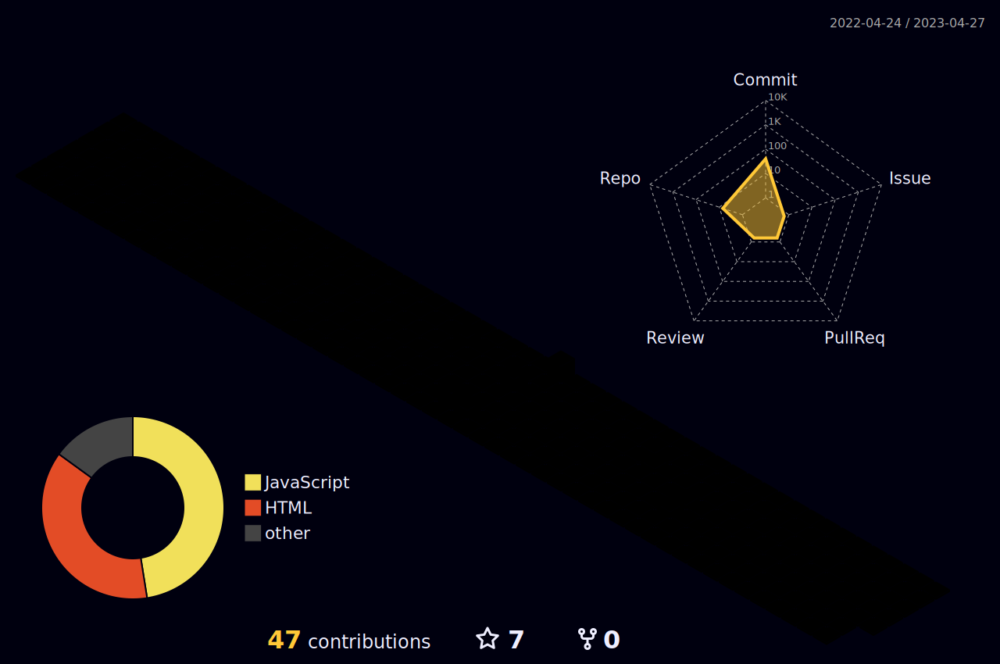

 

 

- Senai.

- Estudante Técnico em Desenvolvimento de Sistemas.

 

<h2 align="center">Olá, Sejam bem-vindos ao meu github!</h2>

### Main skills
- HTML - CSS - JavaScript - PHP - JAVA - ANGULAR- AZURE - SQL - Git & GitHub - VSCODE.

 

   
 
 

 
<b>Visitors Count</b>
  

 
 

